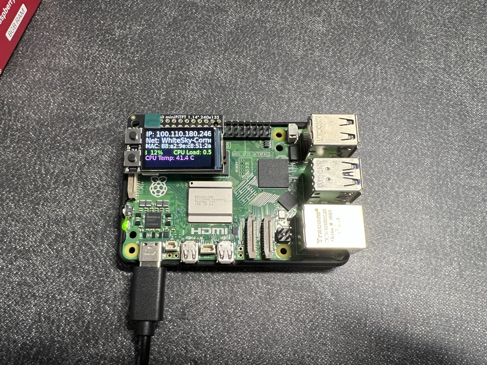
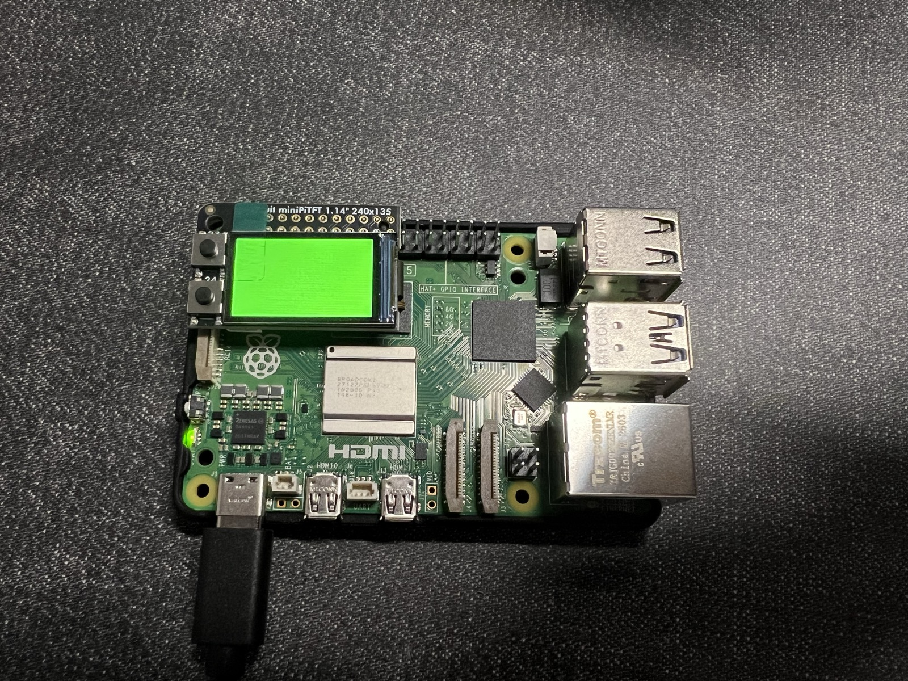
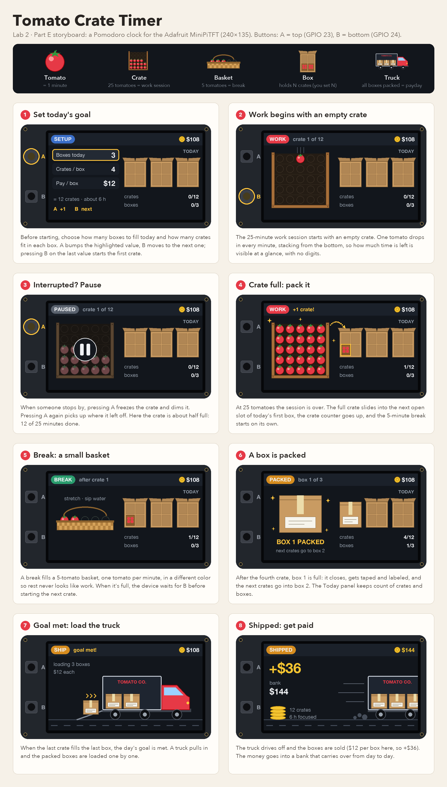
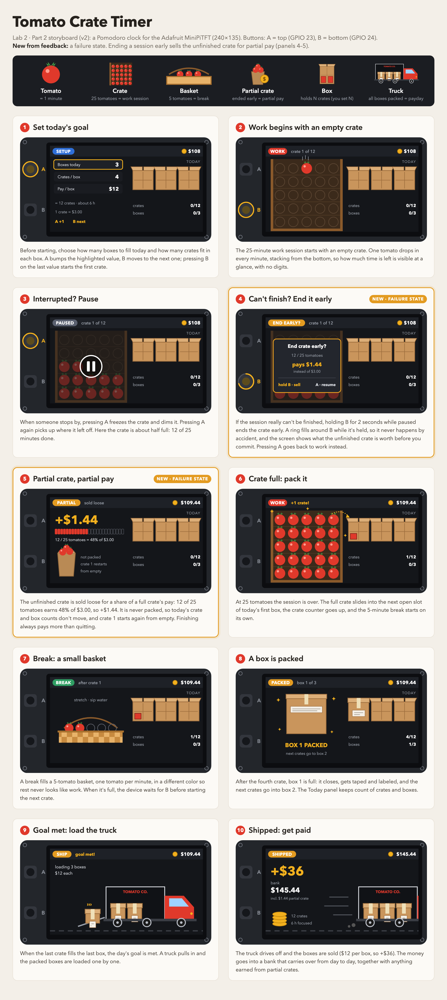

# Interactive Prototyping: The Clock of Pi
**NAMES OF COLLABORATORS HERE**

Does it feel like time is moving strangely during this semester?

For our first Pi project, we will pay homage to the [timekeeping devices of old](https://en.wikipedia.org/wiki/History_of_timekeeping_devices) by making simple clocks.

It is worth spending a little time thinking about how you mark time, and what would be useful in a clock of your own design.

**Please indicate anyone you collaborated with on this Lab here.**
Be generous in acknowledging their contributions! And also recognizing any other influences (e.g. from YouTube, Github, Twitter) that informed your design. 

## Prep

1. ### Set up your Lab 2 Github

At the start of lab Wednesday, ensure you have the latest lab content by updating your forked repository. 

**📖 [Follow the step-by-step guide for safely updating your fork](pull_updates/README.md)**

This guide covers how to pull updates without overwriting your completed work, handle merge conflicts, and recover if something goes wrong.


2. ### Get Kit and Inventory Parts
Take inventory of the kit parts that you have, and note anything that is missing:

***Update your [parts list inventory](partslist.md)***

3. ### Prepare your Pi for lab this week
[Follow these instructions](prep.md) to download and burn the image for your Raspberry Pi before lab Wednesday.


## Overview
For this assignment, you are going to 

A) [Connect to your Pi](#part-a)  

B) [Try out cli_clock.py](#part-b) 

C) [Set up your RGB display](#part-c)

D) [Try out clock_display_demo](#part-d) 

E) [Modify the code to make the display your own](#part-e)

F) [Make a short video of your modified barebones PiClock](#part-f)

G) [Sketch and brainstorm further interactions and features you would like for your clock for Part 2.](#part-g)

## The Report
This readme.md page in your own repository should be edited to include the work you have done. You can delete everything but the headers and the sections between the \*\*\***stars**\*\*\*. Write the answers to the questions under the starred sentences. Include any material that explains what you did in this lab hub folder, and link it in the readme.

Labs are due on Sunday midnight. Make sure this page is linked to on your main class hub page.

## Part A. 
### Connect to your Pi
Just like you did in the lab prep, ssh on to your pi. Once you get there, create a Python environment (named venv) by typing the following commands.

```
ssh pi@<your Pi's IP address>
...
pi@raspberrypi:~ $ python -m venv venv
pi@raspberrypi:~ $ source venv/bin/activate
(venv) pi@raspberrypi:~ $ 

```
### Setup Personal Access Tokens on GitHub
Set your git name and email so that commits appear under your name.
```
git config --global user.name "Your Name"
git config --global user.email "yourNetID@cornell.edu"
```

The support for password authentication of GitHub was removed on August 13, 2021. That is, in order to link and sync your own lab-hub repo with your Pi, you will have to set up a "Personal Access Tokens" to act as the password for your GitHub account on your Pi when using git command, such as `git clone` and `git push`.

Following the steps listed [here](https://docs.github.com/en/authentication/keeping-your-account-and-data-secure/managing-your-personal-access-tokens) from GitHub to set up a token. Depends on your preference, you can set up and select the scopes, or permissions, you would like to grant the token. This token will act as your GitHub password later when you use the terminal on your Pi to sync files with your lab-hub repo.


## Part B. 
### Try out the Command Line Clock
Clone your own lab-hub repo for this assignment to your Pi and change the directory to Lab 2 folder (remember to replace the following command line with your own GitHub ID):

```
(venv) pi@raspberrypi:~$ git clone https://github.com/<YOURGITID>/Interactive-Lab-Hub.git
(venv) pi@raspberrypi:~$ cd Interactive-Lab-Hub/Lab\ 2/
```
Depends on the setting, you might be asked to provide your GitHub user name and password. Remember to use the "Personal Access Tokens" you just set up as the password instead of your account one!

Check if the directory has clone sucessfully, you should see the Interactive-Lab-Hub under the home directory listed:
```
(venv) pi@raspberrypi:~ $ ls
Bookshelf      Documents            Music     Public                 venv
create_img.sh  Downloads            pi-apps   screen_boot_script.py  Videos
Desktop        Interactive-Lab-Hub  Pictures  Templates
(venv) pi@raspberrypi:~ $
```


Install the packages from the requirements.txt and run the example script `cli_clock.py`:

```
(venv) pi@raspberrypi:~/Interactive-Lab-Hub/Lab 2 $ pip install -r requirements.txt
(venv) pi@raspberrypi:~/Interactive-Lab-Hub/Lab 2 $ python cli_clock.py 
02/24/2021 11:20:49
```

The terminal should show the time, you can press `ctrl-c` to exit the script.
If you are unfamiliar with the Python code in `cli_clock.py`, have a look at [this Python refresher](https://hackernoon.com/intermediate-python-refresher-tutorial-project-ideas-and-tips-i28s320p). If you are still concerned, please reach out to the teaching staff!


## Part C. 
### Set up your RGB Display
We have asked you to equip the [Adafruit MiniPiTFT](https://www.adafruit.com/product/4393) on your Pi in the Lab 2 prep already. Here, we will introduce you to the MiniPiTFT and Python scripts on the Pi with more details.


The Raspberry Pi 5 has a variety of interfacing options. When you plug the pi in the red power LED turns on. Any time the SD card is accessed the green LED flashes. It has standard USB ports and HDMI ports. Less familiar it has a set of 20x2 pin headers that allow you to connect a various peripherals.


To learn more about any individual pin and what it is for go to [pinout.xyz](https://pinout.xyz/pinout/3v3_power) and click on the pin. Some terms may be unfamiliar but we will go over the relevant ones as they come up.

### Hardware (you have already done this in the prep)

From your kit take out the display and the [Raspberry Pi 5](https://www.google.com/url?sa=i&url=https%3A%2F%2Fwww.raspberrypi.com%2Fproducts%2Fraspberry-pi-5%2F&psig=AOvVaw330s4wIQWfHou2Vk3-0jUN&ust=1757611779758000&source=images&cd=vfe&opi=89978449&ved=0CBMQjRxqFwoTCPi1-5_czo8DFQAAAAAdAAAAABAE)

Line up the screen and press it on the headers. The hole in the screen should match up with the hole on the raspberry pi.

<p float="left">


</p>

### Testing your Screen

The display uses a communication protocol called [SPI](https://www.circuitbasics.com/basics-of-the-spi-communication-protocol/) to speak with the raspberry pi. We won't go in depth in this course over how SPI works. The port on the bottom of the display connects to the SDA and SCL pins used for the I2C communication protocol which we will cover later. GPIO (General Purpose Input/Output) pins 23 and 24 are connected to the two buttons on the left. GPIO 22 controls the display backlight.

To show you the IP and Mac address of the Pi to allow connecting remotely we created a service that launches a python script that runs on boot. For the following steps stop the service by typing ``` sudo systemctl stop piscreen.service --now```. Othwerise two scripts will try to use the screen at once. You may start it again by typing ``` sudo systemctl start piscreen.service --now```

We can test it by typing 
```
(venv) pi@raspberrypi:~/Interactive-Lab-Hub/Lab 2 $ python screen_test.py
```

You can type the name of a color then press either of the buttons on the MiniPiTFT to see what happens on the display! You can press `ctrl-c` to exit the script. Take a look at the code with
```
(venv) pi@raspberrypi:~/Interactive-Lab-Hub/Lab 2 $ cat screen_test.py
```

#### Displaying Info with Texts
You can look in `screen_boot_script.py` for how to display text on the screen!

#### Displaying an image

You can look in `image.py` for an example of how to display an image on the screen. Can you make it switch to another image when you push one of the buttons?

\*\*\***Include a picture of your own Raspberry Pi displaying the piscreen.service with your unique MAC address. Additionally, please provide another picture showing the successful completion of the screen test.**\*\*\*

> 
> 


## Part D. 
### Set up the Display Clock Demo
Work on `screen_clock.py`, try to show the time by filling in the while loop (at the bottom of the script where we noted "TODO" for you). You can use the code in `cli_clock.py` and `stats.py` to figure this out.

### How to Edit Scripts on Pi
Option 1. One of the ways for you to edit scripts on Pi through terminal is using [`nano`](https://linuxize.com/post/how-to-use-nano-text-editor/) command. You can go into the `screen_clock.py` by typing the follow command line:
```
(venv) pi@raspberrypi:~/Interactive-Lab-Hub/Lab 2 $ nano screen_clock.py
```
You can make changes to the script this way, remember to save the changes by pressing `ctrl-o` and press enter again. You can press `ctrl-x` to exit the nano mode. There are more options listed down in the terminal you can use in nano.

Option 2. Another way for you to edit scripts is to use VNC on your laptop to remotely connect your Pi. Try to open the files directly like what you will do with your laptop and edit them. Since the default OS we have for you does not come up a python programmer, you will have to install one yourself otherwise you will have to edit the codes with text editor. [Thonny IDE](https://thonny.org/) is a good option for you to install, try run the following command lines in your Pi's ternimal:

  ```
  pi@raspberrypi:~ $ sudo apt install thonny
  pi@raspberrypi:~ $ sudo apt update && sudo apt upgrade -y
  ```

Now you should be able to edit python scripts with Thonny on your Pi.

Option 3. A nowadays often preferred method is to use Microsoft [VS code to remote connect to the Pi](https://www.raspberrypi.com/news/coding-on-raspberry-pi-remotely-with-visual-studio-code/). This gives you access to a fullly equipped and responsive code editor with terminal and file browser.  

Pro Tip: Using tools like [code-server](https://coder.com/docs/code-server/latest) you can even setup a VS Code coding environment hosted on your raspberry pi and code through a web browser on your tablet or smartphone! 

## Part E. Read Part 2. Sketch and brainstorm further interactions and features you would like for your clock.

One potential source of ideas might be thinking about other clocks and timekeeping devices for inspiration.

Another might be novel units of time. How do you measure a year? [In daylights? In midnights? In cups of coffee?](https://www.youtube.com/watch?v=wsj15wPpjLY)

We strongly discourage literal digital or analog clock display: Be creative.


** Insert ideas, sketches, [Verplank diagrams](https://ccrma.stanford.edu/courses/250a-fall-2004/IDSketchbok.pdf)), storyboards for your ideas **

### Tomato Crate Timer (a Pomodoro clock)

- A Pomodoro timer that counts time in tomatoes instead of digits: **1 tomato = 1 minute**. A 25-minute work session fills a crate with 25 tomatoes; a 5-minute break fills a small basket with 5.
- The crate fills gradually, bottom-up, so remaining time can be read at a glance. When the crate is full, the session is over.
- Each full crate is packed into a bigger box. The user sets how many boxes to fill per day and how many crates fit in one box, so the "Today" panel records how many sessions are already done.
- Once every box is packed, the day's Pomodoro goal is met: an animation shows the boxes being loaded onto a truck and shipped away in exchange for money, which accumulates across sessions.



## AI Disclosure
> - I used Claude to help me debug the configuration of my raspberrypi (the
> WiFi config)
> - I asked Claude to help me generate a visual storyboard based on my 
> Pomodoro idea write up, and help me polish the text. Prompt I used: "help me generate a storyboard for partE: - Create a recording device for Pomodoro Technique. It will record 25 minutes work time and 5 minutes break time using tomato icons and container box. It will also record how many sections the user have already completed. - For each work/break session, the timer will be denoted by a container box gradually filled with tomato. When the container is completely filled, the session time is up. - Once a session is completed, the filled container will be added to a bigger box. User can customize how many box they want to fill per day, and how many container can be placed inside a single box. - Once all boxes are filled, the user required Pomodoro session is finished. And a animation will show the boxes gets loaded into a truck and ships away in exchange for~ money, which user can accumulate over sessions."


**Put the names of the people you gave feedback to here. (Even better, add links to their repos here!)**
> https://github.com/certaindragon3/Interactive-Lab-Hub/tree/Fall2026/Lab%202
>
> https://github.com/MortalJin/Interactive-Lab-Hub/tree/Fall2026/Lab%202
> 
> https://github.com/zg375/Interactive-Lab-Hub/tree/e91f5f8e997dfdaf5a03c0d61ae5432bec2a5c94/Lab%202

# Lab 2 Part 2

## Prep 

1. Pick up remaining parts for kit on Wednesday lab class. Check the updated [parts list inventory](partslist.md) and let the TA know if there is any part missing.

2. Look at and give feedback on the Part E. for at least 3 other people in the class and get 3 people to comment on your Part E!)
**Put the feedback for your ideas here.**
> It is missing a failure mode, where user failed to complete a 25 min work session. 
> User could receive partial reward or even punishment when they fail to fill a crate with 25 tomatos. 

## Update your Lab Hub

[Update your Lab Hub](pull_updates/README.md) to get the latest content and requirements for Part 2.

## Modify the barebones clock to make it your own

Start small, pick just one element of your overall idea, just to show you have a handle on the code and components.

\*\*\***Put a copy of your code in your Lab 2 Github repo.**\*\*\*
[Link to code](tomato_clock.py)

## Make a short video of your modified barebones PiClock

\*\*\***Take a video of your barely modified PiClock.**\*\*\*

https://github.com/user-attachments/assets/ae4726a9-d2e5-4f19-ae29-16bb844283a0

[Link to mp4 file](assets/barebone.mp4)

After you edit and work on the scripts for Lab 2, the files should be upload back to your own GitHub repo! You can push to your personal github repo by adding the files here, commiting and pushing.

```
(venv) pi@raspberrypi:~/Interactive-Lab-Hub/Lab 2 $ git add .
(venv) pi@raspberrypi:~/Interactive-Lab-Hub/Lab 2 $ git commit -m 'your commit message here'
(venv) pi@raspberrypi:~/Interactive-Lab-Hub/Lab 2 $ git push
```

After that, Git will ask you to login to your GitHub account to push the updates online, you will be asked to provide your GitHub user name and password. Remember to use the "Personal Access Tokens" you set up in Part A as the password instead of your account one! Go on your GitHub repo with your laptop, you should be able to see the updated files from your Pi!

## Now, make your own PiClock

Do take advantage of having done the previous iteration to refine and simplify your design.

** Insert any updates ideas, sketches, [Verplank diagrams](https://ccrma.stanford.edu/courses/250a-fall-2004/IDSketchbok.pdf))!, storyboards for your ideas **

### Updated storyboard: adding a failure state

Feedback on Part E pointed out a missing failure mode: what happens when a work session isn't finished. The updated storyboard adds it (panels 4–5):

- **End early:** while paused, holding B for 2 seconds ends the current crate. A ring fills around B so it can't happen by accident, and the screen shows what the unfinished crate is worth before committing. Pressing A resumes instead.
- **Partial reward:** the unfinished crate is sold loose for a share of a full crate's pay (tomatoes / 25). With $12 per box and 4 crates per box, a crate is worth $3.00, so 12 of 25 tomatoes earns $1.44. The partial crate is not packed, so it doesn't count toward the day's boxes, and the crate restarts from empty. Finishing always pays more than quitting.



### The finished clock

The storyboard is implemented in two files:

- [tomato_crate_timer.py](tomato_crate_timer.py) — state machine, buttons, and saved progress
- [tomato_render.py](tomato_render.py) — all the drawing (pure PIL, no hardware, so any screen can be rendered to a PNG on a laptop)

Run it on the Pi:

```
(venv) pi@raspberrypi:~/Interactive-Lab-Hub/Lab 2 $ sudo systemctl stop piscreen.service
(venv) pi@raspberrypi:~/Interactive-Lab-Hub/Lab 2 $ python tomato_crate_timer.py
(venv) pi@raspberrypi:~/Interactive-Lab-Hub/Lab 2 $ python tomato_crate_timer.py --seconds-per-tomato 2   # fast demo
(venv) pi@raspberrypi:~/Interactive-Lab-Hub/Lab 2 $ python tomato_crate_timer.py --png-tour out            # render every screen, no hardware needed
```

For a video, [tomato_demo.py](tomato_demo.py) skips setup and speed-runs the real timer: the 25-tomato crate fills in 15 s and the break basket in 5 s. Buttons still work, and it saves to a throwaway file so the real day and bank are untouched.

```
(venv) pi@raspberrypi:~/Interactive-Lab-Hub/Lab 2 $ python tomato_demo.py                                   # one crate + break, then waits on ready
(venv) pi@raspberrypi:~/Interactive-Lab-Hub/Lab 2 $ python tomato_demo.py --loop                            # crate, break, crate, ... until Ctrl-C
(venv) pi@raspberrypi:~/Interactive-Lab-Hub/Lab 2 $ python tomato_demo.py --work-seconds 10 --break-seconds 3
```

**Controls**

| Screen | A (top) | B (bottom) |
| --- | --- | --- |
| Setup | next value for the highlighted row | next row, wrapping round so settings can be revisited |
| Setup · "Start day" row | — | — (**A + B together** starts the day) |
| Work | pause | — |
| Paused | resume | hold 2 s to end the crate early; let go sooner to cancel |
| Partial (day ended early) | back to settings | back to settings |
| Ready / break done | — | start the next crate |
| Crate packed · box packed · shipping | — | skip ahead |
| Day done | back to settings for a new day | back to settings for a new day |

The two screens that record something you might want to sit with — a day given up on, and a day finished — wait for a button instead of moving on by themselves. The bank carries over into the new day.

**How it works**

- 1 tomato = 1 minute, drawn from elapsed time rather than counted loop passes, so the timer doesn't drift. 25 tomatoes fill a crate (work), 5 fill a basket (break).
- Full crates are packed into boxes. When the day's boxes are packed, the truck animation plays and the pay lands in the bank.
- Ending a crate early ends the day. The loose crate sells for `tomatoes / 25` of a crate's pay, any **full** boxes are shipped and paid right away, and crates sitting in an unfinished box are lost. The clock then returns to settings so the next session can be set up differently. Finishing always pays more than quitting.
- Progress is saved to `tomato_state.json` after every change, so a restart picks up the same day, and the bank carries over between days.

\*\*\***Put a copy of your code in your Lab 2 Github repo.**\*\*\*

\*\*\***Take a video of your PiClock.**\*\*\*

> Demo for when user actually finish the session:

https://github.com/user-attachments/assets/7f9c1c77-1d31-4bbe-9515-d14aacc7539e

[Download video mp4 here](assets/complete_demo.mp4)

> Demo for when user ends the session early:

https://github.com/user-attachments/assets/c9b6dcb5-56d9-4aff-8ae1-5d3bd2da5d43

[Download video mp4 here](assets/final_clock.mp4)

## AI Disclosure
> - I used Claude to help me write the code for the clock and added 
> documentation on user instructions
> - For iterations on the clock (which details are not included in here), I came up with the ideas and areas to improve, and instructed Claude to implement


As always, make sure you document contributions and ideas from others (and AI) explicitly in your writeup.

You are permitted (but not required) to work in groups and share a turn in; you are expected to make equal contribution on any group work you do, and N people's group project should look like N times the work of a single person's lab.  Make sure the page for the group turn in is linked to your personal Interactive Lab Hub page. 


