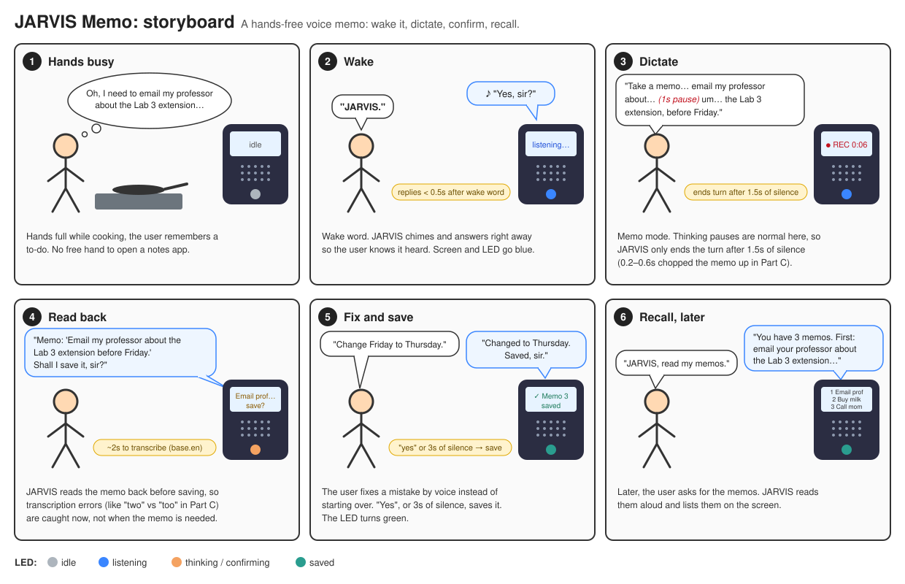
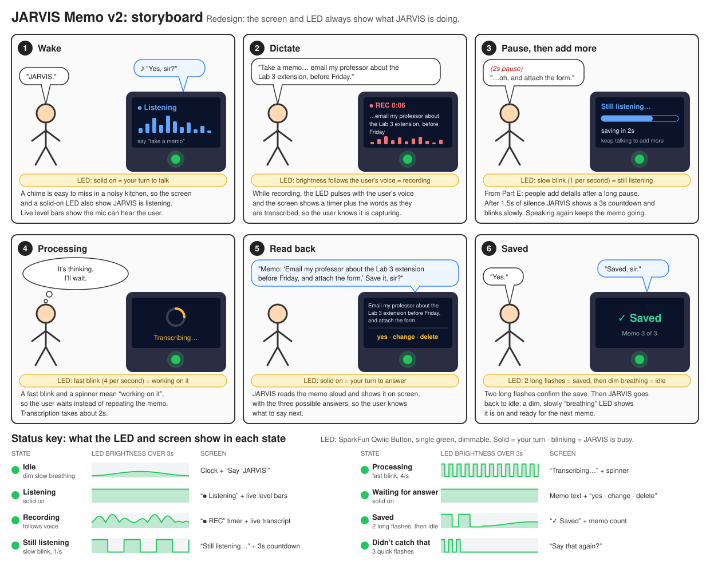
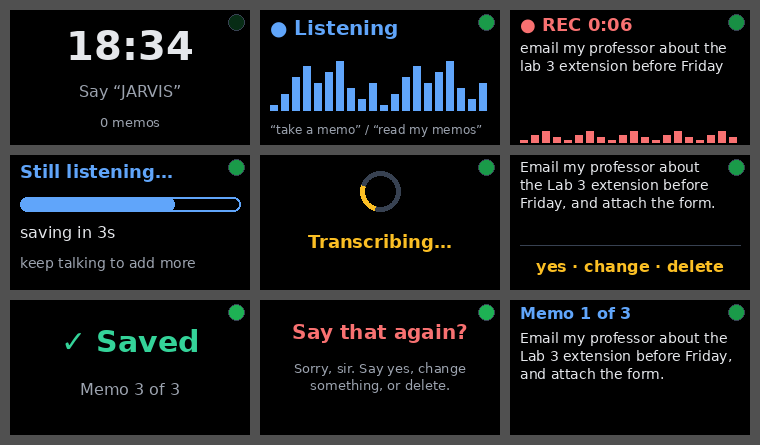
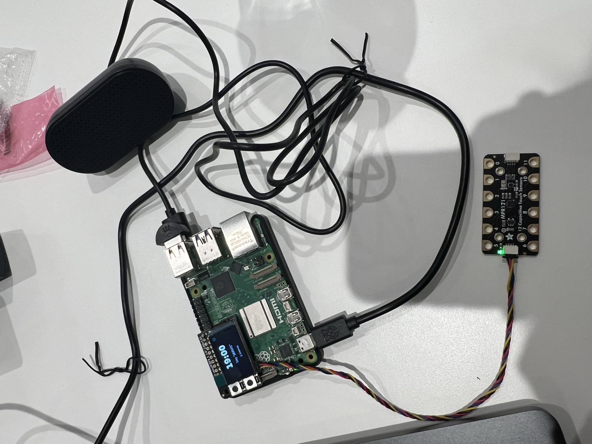
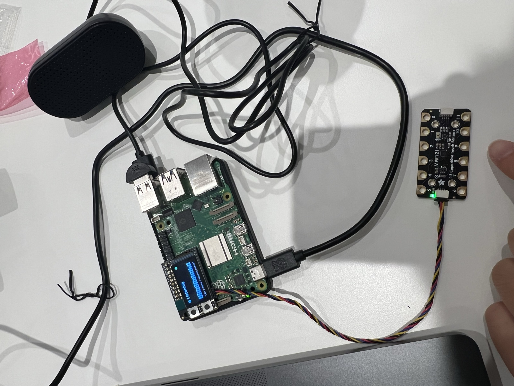
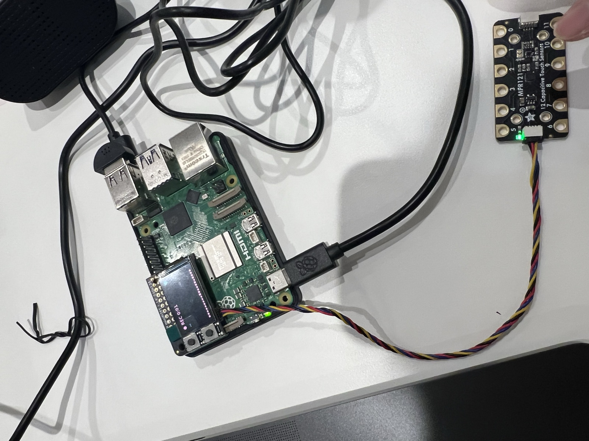

# Chatterboxes

**NAMES OF COLLABORATORS HERE**

# Part 1

## A. Text to Speech

**Write your own shell file to use your favorite of these TTS engines to have your Pi greet you by name.**

> The file is saved at ["speech-scripts/jarvis_greeting.sh"](speech-scripts/jarvis_greeting.sh)

**Is the same greeting, in these different voices, the same greeting? Describe one concrete way the voice changed what the utterance seemed to mean or who seemed to be speaking.**

> When using espeak and festival, they conveyed a real robotic ans synthesized feeling, and didn't make me feel very welcomed. And it feels like I am talking to a rigid robot.
> When using piper and selecting a more humane voice, I feel more welcomed and it feels more like talking to a real person.

## B. Speech to Text

**Record a few seconds of your own speech and transcribe it with at least two model sizes. Report the real-time factor for each. At what point does the accuracy improvement stop being worth the delay, for a system that has to answer you?**

> I recorded 5 seconds saying *"This is a test, this is a test, testing now."* ([speech-scripts/test.wav](speech-scripts/test.wav)) and transcribed it on the Pi 5 with three model sizes (int8, beam=1):
>
> | Model | Transcript | Transcription time | Real-time factor |
> |---|---|---|---|
> | tiny.en | "This is a **task**, this is a **task** testing now." | 1.09s | 0.22x |
> | base.en | "This is a **test**, this is a **test** testing now." | 2.15s | 0.43x |
> | small.en | "this is a **task** this is a **task** testing now" | 5.76s | 1.15x |
>
> In my case moving from tiny to base is worth it, since it only adds 1 sec and gets the transcription correctly. However, keeping moving up the size adds 3 sec and returns a incorrect transcription. So base is the cutoff.

**Write your own script that verbally asks for a numerical input and records the answer the respondent provides.**

> The script is saved at ["speech-scripts/ask_phone_number.py"](speech-scripts/ask_phone_number.py). It asks for a phone number in the JARVIS voice (Piper `en_GB-alan-medium`), records a fixed window, transcribes it with `base.en`, extracts the digits, and reads them back. Each answer is saved as a `.wav` plus a row in [phone_answers/answers.csv](speech-scripts/phone_answers/answers.csv). I answered with a made-up number, 212-555-0199:
>
> | Try | Window | Transcript | Digits | Transcription time |
> |---|---|---|---|---|
> | 1 ([audio](speech-scripts/phone_answers/phone_20260923_184609.wav)) | 8s | "2, 1, 2, 5, 5, 5, 0, 1" | 8 — cut off | 2.16s |
> | 2 ([audio](speech-scripts/phone_answers/phone_20260923_184711.wav)) | 12s | "2 1 2 5 5 5 0 1 9 9" | 10 — correct | 1.92s |
>
> Whisper made no digit errors; the failure in try 1 was the fixed recording window. The recording shows ~2s of silence before I started speaking and a pause between digit groups, so I was still saying the last digits when the 8s window closed. A fixed window has to be long enough for the slowest answer, which makes every fast answer wait — this is the problem endpointing in Part C solves.

## C. Turn-taking

**Try both extremes, and something in between. Describe what each one feels like to talk to. At 0.2s, what kinds of normal speech get cut off? At 1.5s, what does the delay make the system seem like?**

> In each run (30s, default `tiny.en`) I said the same thing, with natural pauses: *"JARVIS, I'd like to order… um… a large coffee… and actually, make that two. My number is 212… 555… 0199."* Each line below is one utterance the VAD decided was a complete turn:
>
> | `--min-silence` | Turns | What it heard |
> |---|---|---|
> | 0.2s | 6 | "See you all there." / "on a large coffee." / "and actually make that too." / "My number is 212." / "5.5." / "0199." |
> | 0.6s | 5 | "I'd like to order." / "a large coffee and actually make that too." / "My number is 212." / "555." / "0199." |
> | 1.5s | 1 | "other large coffee and actually make that too. My number is 212-55-0199." (14.8s of speech) |
>
> | `--min-silence` | Transcription per turn | Wait after I stop (silence + transcription) |
> |---|---|---|
> | 0.2s | ~0.9s | ~1.1s |
> | 0.6s | ~0.9s | ~1.5s |
> | 1.5s | 1.19s | ~2.7s |
>
> at 0.2s, any pause in the speech will get cut off.
> at 1.5s, longer pause is allowed and recored, and the continuity is preserved. The system feels like it is a keen listener.

## D. Storyboard

**Storyboard**

> **JARVIS Memo** is a hands-free voice memo device: wake it by name, dictate a memo, hear it read back, fix or save it, and have it read your memos later. It is meant for moments when your hands are busy (cooking, carrying things) and you remember something you will otherwise forget.
>
> 

**Please describe and document your process.**

**Dialogue script, with pauses**

> **Dialogue script** (LED colours as in the storyboard):
>
> | # | Who | Says / does | Device waits |
> |---|---|---|---|
> | 1 | User | "JARVIS." | — |
> | 2 | JARVIS | ♪ chime, "Yes, sir?" LED blue. | Replies within 0.5s of the wake word. Then listens up to **5s** for the user to start; if nothing, says "Standing by." and goes idle. |
> | 3 | User | "Take a memo… email my professor about… um… the Lab 3 extension, before Friday." | Memo mode: the turn ends only after **1.5s of silence**, so thinking pauses stay inside the memo. |
> | 4 | JARVIS | LED amber while transcribing (~2s), then: "Memo: 'Email my professor about the Lab 3 extension before Friday.' Shall I save it, sir?" | Waits **3s** for an answer. |
> | 5a | User | "Yes." → JARVIS: "Saved, sir." LED green. | Yes/no answers end after **0.6s of silence**: they are short and should feel snappy. |
> | 5b | User | "Change Friday to Thursday." → JARVIS: "Changed to Thursday. Saved, sir." | 0.6s |
> | 5c | User | "No, delete it." → JARVIS: "Memo discarded." LED back to grey. | 0.6s |
> | 5d | User | *(says nothing)* → JARVIS: "Saved, sir." | After the 3s wait, silence counts as yes. |
> | 6 | User (later) | "JARVIS, read my memos." | 0.6s |
> | 7 | JARVIS | "You have 3 memos. First: email your professor about the Lab 3 extension before Thursday." | Pauses **1s** between memos so the user can say "stop" or "delete that one". |
>
> The main timing decision is using **two different silence thresholds**: 1.5s while dictating (in Part C, 0.2s and 0.6s split a paused sentence into 5–6 fragments) and 0.6s for short commands and yes/no answers, where a 1.5s threshold meant ~2.7s of silence before any reply.

## E. Acting out the dialogue

**Describe if the dialogue seemed different than what you imagined when it was acted out, and how.**

> It is hard to determine if the user is actually done with the memo. The user might remember to add some very last minute details or changes, and after a long pause, but the model already cut off because of the configured time.

---

# Part 2

## Prep for Part 2

**1. What are concrete things that could use improvement in the design of your device?**

> Improve the indication of the current status of the device: listening, recording, processing, etc.

**2. What are other modes of interaction *beyond speech* that you might also use to clarify how to interact? How does someone know when the device is listening, and when it is thinking?**

> 1. The screen should display the current status
> 2. Will add a LED that blinks in patterns according to the current status of the device

**3. A new storyboard based on these reflections**

> 
>
> The redesign keeps the same memo flow as Part 1, but every state now has its own screen view and LED pattern, so the user never has to guess whether JARVIS is listening, recording, or thinking. The LED is the single green LED on a [SparkFun Qwiic Button](https://www.sparkfun.com/sparkfun-qwiic-button-green-led.html), so states differ by brightness pattern rather than colour: solid means it is your turn to talk, blinking means JARVIS is busy, and flashes mean it is done. It also adds a **"still listening" grace period** (panel 3) for the problem found in Part E: after 1.5s of silence JARVIS shows a 3s countdown instead of cutting the memo off, and speaking again keeps recording.

## Prototype

### How the system works

> **JARVIS Memo** runs entirely on the Raspberry Pi 5 as one Python script, [speech-scripts/jarvis_memo.py](speech-scripts/jarvis_memo.py). Speech recognition and the voice both run on the Pi; nothing is sent to a server.
>
> **Hardware**
>
> | Part | Role |
> |---|---|
> | USB microphone (TI PCM2902) | Hears the user |
> | USB speaker | JARVIS's voice |
> | Adafruit Mini PiTFT (240×135) | Shows what JARVIS is doing |
> | MPR121 capacitive touch sensor (I2C `0x5A`, plugged into the screen's STEMMA QT port) | Tap shortcuts |
> | SparkFun Qwiic Button (green LED) | Status LED. In testing the Pi could not detect it on I2C, so the script draws the LED as a green dot on the screen instead, with the same patterns. |
>
> **How to use it.** Every command works by voice or by tapping any of the touch pads:
>
> | Say | Or tap | JARVIS does |
> |---|---|---|
> | "JARVIS" | 1 tap | Chimes, says "Yes, sir?", and waits up to 5s for a command |
> | "Take a memo" (or "JARVIS, take a memo, …" in one breath) | 2 quick taps | Beeps and records the memo |
> | "Read my memos" | 3 quick taps | Reads every memo aloud, with a 1s gap between them |
>
> After a memo is recorded, JARVIS reads it back and asks "Save it, sir?". The user can answer:
> - "Yes", or stay silent for 3s: the memo is saved.
> - "Change Friday to Thursday": JARVIS makes the edit and saves. Several changes can be given in one answer.
> - "No" / "Delete it": the memo is discarded.
>
> **Status: screen and LED.** Every state has its own screen and LED pattern. The rule for the LED: solid means it is the user's turn to talk, blinking means JARVIS is busy, flashes mean it is done.
>
> | State | LED | Screen |
> |---|---|---|
> | Idle | Dim, slow breathing | Clock, "Say JARVIS", memo count |
> | Listening | Solid on | "● Listening" + live mic level bars |
> | Recording | Brightness follows the user's voice | "● REC" timer + live transcript |
> | Still listening | Slow blink (1/s) | 3s countdown bar: "keep talking to add more" |
> | Processing | Fast blink (4/s) | "Transcribing…" spinner |
> | Confirm | Solid on | The memo + "yes · change · delete" |
> | Saved | 2 long flashes | "✓ Saved" |
> | Error | 3 quick flashes | "Say that again?" + what went wrong |
> | Reading | Gentle pulse | "Memo 1 of 3" + the memo text |
>
> 
>
> *The nine screen states, rendered by the script's own drawing code. The green dot in the top-right corner is the on-screen LED.*

### The system and the controller

> The system: the Pi 5 with the Mini PiTFT screen, the USB speaker and microphone, and the MPR121 touch sensor connected to the screen's STEMMA QT port.
>
> | Idle | Listening | Recording |
> |---|---|---|
> |  |  |  |
> | The clock, "Say JARVIS" and the number of saved memos. | After one tap (or "JARVIS"): "● Listening" with live mic level bars. | After two taps (or "take a memo"): the "● REC" timer counting while the memo is dictated. |

## Test the system

### What worked well about the system and what didn't?
> What worked well: the screen states and LED clearly signals the user what is happening at the moment
>
> What didn't: testers not sure how to proper end the memo after finish talking. Had to wait for a few seconds until the screen says "transcribing"

### What worked well about the controller and what didn't?
> What worked well: good to wake up the memo device and start writing a memo in noisy environment
>
> What didn't: the controller is hard to capture double tap and 3 taps

### What lessons can you take away from the WoZ interactions for designing a more autonomous version of the system?
> The device can misheard and takes them literally. Unless using certain LLM model, the commands can be hard to be catch by the device, and the recorded memos could have mistakes.
>
> A human acting as the device can give a better cue than device itself. The cue on device needs to be obvious, and easy for human to refer to its actual meaning.

### How could you use your system to create a dataset of interaction? What other sensing modalities would make sense to capture?
> Recognition errors paired with the correct answers. Used to identify words or phrases that are usually misheard by machine, and what is the actual words.
>
> Other sensing modalities: a proximity sensor to control the device. Could be more flexible than tapping.

### AI disclosure ###
> I used Claude to help me create the updated storyboard, script for the memo, and formulate the README for submission. 
